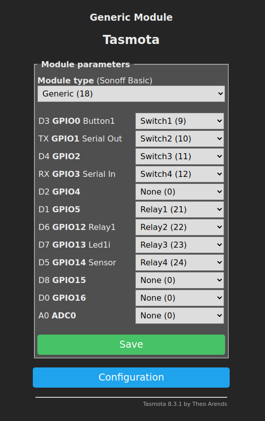

# tasmota-shutter-control

A simple command line tool to control shutters.

Turns your 4-channel shutter remote control into a wifi shutter control using a cheap $5 tasmota (ESP8266) device.

This application can be easily integrated into your home automation system like FHEM or pimatic.


## Hardware requirements:

* Your stock 4-channel remote control
* A cheap ESP8266 device flashed with tasmota and at least 8 accesible io ports (For exmaple a D1 mini)
* Some soldering skills

## Bulding:

```
sudo apt-get install git build-essential cmake
git clone https://github.com/BenDr0id/tasmota-shutter-control.git
cd tasmota-shutter-control && mkdir build && cd build
cmake ..
make
```

## Tasmota configuration:

Execute the following in the console of your tasmota device line by line:

```
Rule1 on Switch1#state do Publish cmnd/custom-topic/SWITCH1 %value% endon on Switch2#state do Publish cmnd/custom-topic/SWITCH2 %value% endon on Switch3#state do Publish cmnd/custom-topic/SWITCH3 %value% endon on Switch4#state do Publish cmnd/custom-topic/SWITCH4 %value% endon

SwitchMode1 2
SwitchMode2 2
SwitchMode3 2
SwitchMode4 2

PulseTime1 10
PulseTime2 10
PulseTime3 10
PulseTime4 10
```

Configure your tasmota module like this and save the configuration:





## Usage:

```
Tasmota-Shutter-Control 1.0
Usage: ./tasmota-shutter-control [OPTIONS]

Options:
  -h,--help                   Print this help message and exit
  -i,--ip ADDRESS REQUIRED    The IP of the Tasmota device
  -o,--operation OP:{UP,DOWN,SELECT,STOP} REQUIRED
                              The Operation to execute
  -s,--shutter NUM:INT in [1 - 4] REQUIRED
                              The number of the shutter to control
```


